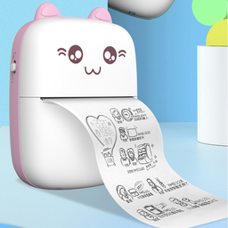

Alternative App for Cheap Chinese Thermal Printer
=================================================

Recently I bought a cat-shaped cheap chinese thermal printer similar to this one:

According to the manual, it works with Android/iOS app named `iPrint`, and it actually works.
But other Android apps I checked do not work with it, and the `iPrint` app is awfully unusable IMO.
I tried to connect the printer to laptop using USB cable, and it was not detected at all, despite there are data lines on the printer's board.

So I decoded the `iPrint` app and reversed the protocol used. Hope it will help someone too.

The printer is connected over Bluetooth LE, so you will need a compatible adapter installed on your computer.

Usage
-----

### Print certain image

`python blueprint.py filename.png [-p]`

Image will be resized to printer's paper width and dithered to black&white.
Add `-p` to preview image before printing.

Script will scan for available printer(s); for only one is expexted to be found. It will then connect, print and disconnect.

### Sticker/label mode

After modifying the printer a bit, it is possible to feed it with a roll of 58x40mm labels.
(Printer itself supports max paper width of 57mm, so stuffing labels into it requires cutting its case a bit and making a slit in the back cover.)
The `sticker.py` script reads text from stdin (can be a text file), then renders it to the image using font from `font.ttf` (you should provide it) with the maximum fitting font, then either shows the resulting image or prints it:

`cat myfile.txt | python sticker.py [-p]`

Note it is still work in progress.
